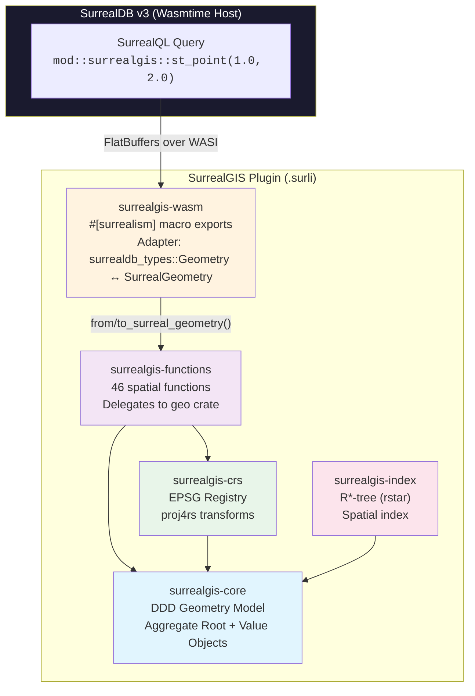
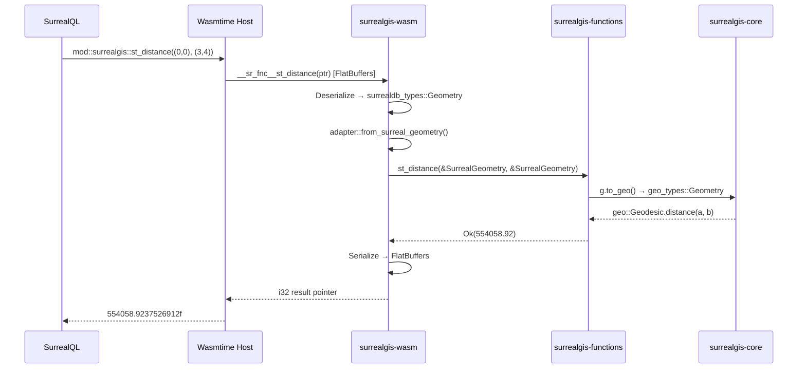
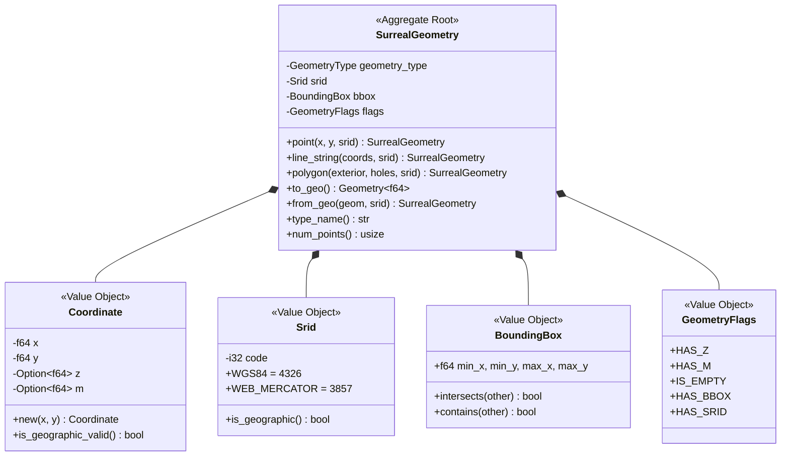
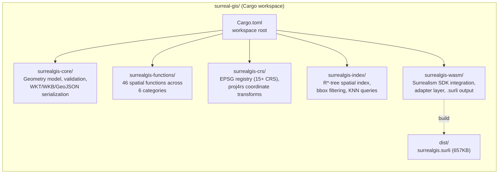

# SurrealGIS

PostGIS-equivalent geospatial extension for SurrealDB v3, built as a [Surrealism](https://surrealdb.com/docs/surrealdb/querying/surrealism/tutorial) WASM plugin in Rust.

SurrealDB ships with only 5 geo functions and 5 spatial operators. SurrealGIS delivers **46 spatial functions** covering constructors, accessors, predicates (DE-9IM), measurement, CRS transforms, and serialization formats (WKT/WKB/GeoJSON/EWKT) -- a **10x improvement** over SurrealDB's built-in capabilities, packaged as a single `.surli` plugin (657KB).

## Objective

Bring full PostGIS-class geospatial capabilities to SurrealDB without requiring external services or custom database forks. SurrealGIS runs as a sandboxed WASM plugin inside SurrealDB v3, providing:

- **Geometry construction** -- create Points, LineStrings, Polygons, and envelopes from SurrealQL
- **Spatial predicates** -- full DE-9IM relationship matrix (intersects, contains, within, touches, crosses, overlaps, covers, etc.)
- **Measurement** -- geodesic and Euclidean distance, area, length, perimeter, azimuth
- **CRS transforms** -- reproject between 15+ coordinate reference systems (WGS84, Web Mercator, UTM zones, Lambert, NAD83, etc.)
- **Format interop** -- read/write WKT, WKB, GeoJSON, EWKT
- **Spatial indexing** -- R*-tree index for efficient bbox queries and nearest-neighbor lookups

## Architecture



### Data Flow



## DDD Domain Model



## Project Structure



```
surreal-gis/
├── Cargo.toml                      # Workspace root (5 crates)
├── surrealgis-core/                # Pure geometry domain model
│   └── src/
│       ├── geometry.rs             #   Aggregate Root: SurrealGeometry
│       ├── coordinate.rs           #   Value Object: Coordinate (x, y, z, m)
│       ├── srid.rs                 #   Value Object: SRID (WGS84, Web Mercator, ...)
│       ├── bbox.rs                 #   Value Object: BoundingBox
│       ├── flags.rs                #   Value Object: GeometryFlags
│       ├── validation.rs           #   Ring/polygon validation rules
│       ├── error.rs                #   Domain error types
│       ├── convert/                #   geo_types ↔ SurrealGeometry converters
│       └── serialization/          #   WKT, WKB, GeoJSON, EWKT parsers
├── surrealgis-functions/           # Spatial function implementations
│   └── src/
│       ├── constructors/           #   st_point, st_make_line, st_make_polygon, ...
│       ├── accessors/              #   st_x, st_y, st_centroid, st_boundary, ...
│       ├── relationships/          #   st_intersects, st_contains, st_relate, ...
│       ├── measurement/            #   st_distance, st_area, st_length, st_azimuth, ...
│       ├── output/                 #   st_as_text, st_as_wkb, st_as_geojson, ...
│       └── crs/                    #   st_transform, st_set_srid
├── surrealgis-crs/                 # Coordinate Reference System management
│   └── src/
│       ├── registry.rs             #   15+ EPSG definitions (4326, 3857, UTM, ...)
│       ├── projection.rs           #   proj4rs wrapper
│       └── transform.rs            #   Coordinate reprojection logic
├── surrealgis-index/               # Spatial indexing
│   └── src/
│       ├── rtree_index.rs          #   R*-tree via rstar crate
│       ├── bbox_filter.rs          #   Bounding box pre-filter
│       ├── spatial_index.rs        #   SpatialIndex trait
│       └── indexed_geometry.rs     #   Geometry → RTreeObject adapter
├── surrealgis-wasm/                # WASM plugin boundary
│   ├── Cargo.toml                  #   edition 2024, cdylib + rlib
│   ├── surrealism.toml             #   Plugin metadata (@locobuzz/surrealgis)
│   └── src/
│       ├── adapter.rs              #   surrealdb_types::Geometry ↔ SurrealGeometry
│       └── exports/                #   46 #[surrealism] annotated functions
│           ├── constructors.rs     #     5 functions
│           ├── accessors.rs        #     17 functions
│           ├── relationships.rs    #     11 functions
│           ├── measurement.rs      #     7 functions
│           ├── output.rs           #     4 functions
│           └── crs.rs              #     2 functions
└── dist/
    └── surrealgis.surli            # Built plugin package (657KB)
```

## Function Reference (46 Functions)

### Constructors (5)

| Function | Signature | Description |
|---|---|---|
| `st_point` | `(float, float) -> geometry` | Create Point from x, y |
| `st_make_point` | `(float, float) -> geometry` | Alias for st_point |
| `st_make_line` | `(array<geometry>) -> geometry` | Create LineString from Points |
| `st_make_polygon` | `(geometry, array<geometry>) -> geometry` | Create Polygon from exterior ring + holes |
| `st_make_envelope` | `(float, float, float, float) -> geometry` | Create rectangle Polygon from xmin, ymin, xmax, ymax |

### Accessors (17)

| Function | Signature | Description |
|---|---|---|
| `st_x` | `(geometry) -> float` | Extract X coordinate from Point |
| `st_y` | `(geometry) -> float` | Extract Y coordinate from Point |
| `st_z` | `(geometry) -> none \| float` | Extract Z coordinate (None if 2D) |
| `st_srid` | `(geometry) -> int` | Get SRID (default: 4326) |
| `st_geometry_type` | `(geometry) -> string` | Get type name ("Point", "Polygon", ...) |
| `st_num_points` | `(geometry) -> int` | Count all coordinates |
| `st_dimension` | `(geometry) -> int` | Topological dimension (0=point, 1=line, 2=polygon) |
| `st_start_point` | `(geometry) -> geometry` | First point of LineString |
| `st_end_point` | `(geometry) -> geometry` | Last point of LineString |
| `st_is_empty` | `(geometry) -> bool` | Check if geometry has no coordinates |
| `st_is_valid` | `(geometry) -> bool` | Validate geometry structure |
| `st_is_closed` | `(geometry) -> bool` | Check if LineString first == last point |
| `st_is_ring` | `(geometry) -> bool` | Check if closed and simple |
| `st_envelope` | `(geometry) -> geometry` | Bounding box as Polygon |
| `st_centroid` | `(geometry) -> geometry` | Geometric centroid |
| `st_point_on_surface` | `(geometry) -> geometry` | Guaranteed interior point |
| `st_boundary` | `(geometry) -> geometry` | Geometry boundary |

### Spatial Relationships (11)

| Function | Signature | Description |
|---|---|---|
| `st_intersects` | `(geometry, geometry) -> bool` | Geometries share any space |
| `st_contains` | `(geometry, geometry) -> bool` | First completely contains second |
| `st_within` | `(geometry, geometry) -> bool` | First is completely within second |
| `st_touches` | `(geometry, geometry) -> bool` | Boundaries touch, interiors don't overlap |
| `st_crosses` | `(geometry, geometry) -> bool` | Geometries cross each other |
| `st_overlaps` | `(geometry, geometry) -> bool` | Partial overlap of same dimension |
| `st_disjoint` | `(geometry, geometry) -> bool` | No shared space |
| `st_equals` | `(geometry, geometry) -> bool` | Topologically equal |
| `st_covers` | `(geometry, geometry) -> bool` | No point of second is exterior to first |
| `st_covered_by` | `(geometry, geometry) -> bool` | No point of first is exterior to second |
| `st_relate` | `(geometry, geometry) -> string` | DE-9IM intersection matrix (e.g., "FF2F11212") |

### Measurement (7)

| Function | Signature | Description |
|---|---|---|
| `st_distance` | `(geometry, geometry) -> float` | Distance (geodesic for WGS84, Euclidean for projected) |
| `st_distance_sphere` | `(geometry, geometry) -> float` | Always geodesic distance (meters) |
| `st_area` | `(geometry) -> float` | Area of Polygon/MultiPolygon |
| `st_length` | `(geometry) -> float` | Length of LineString |
| `st_perimeter` | `(geometry) -> float` | Perimeter of Polygon |
| `st_azimuth` | `(geometry, geometry) -> float` | Geodesic bearing between Points (radians) |
| `st_dwithin` | `(geometry, geometry, float) -> bool` | True if distance <= threshold |

### Output (4)

| Function | Signature | Description |
|---|---|---|
| `st_as_text` | `(geometry) -> string` | Well-Known Text (WKT) |
| `st_as_wkb` | `(geometry) -> string` | Well-Known Binary (hex string) |
| `st_as_geojson` | `(geometry) -> string` | GeoJSON string |
| `st_as_ewkt` | `(geometry) -> string` | Extended WKT with SRID prefix |

### CRS Transforms (2)

| Function | Signature | Description |
|---|---|---|
| `st_transform` | `(geometry, number) -> geometry` | Reproject to target SRID |
| `st_set_srid` | `(geometry, number) -> geometry` | Change SRID metadata (no reprojection) |

## Prerequisites

- **Rust** >= 1.85 (edition 2024 support) via [rustup](https://rustup.rs/)
- **wasm32-wasip1** target for WASM compilation
- **surrealism-cli** for building `.surli` packages
- **SurrealDB v3.0.0+** for running the plugin

```bash
# Install Rust (if not already installed)
curl --proto '=https' --tlsv1.2 -sSf https://sh.rustup.rs | sh

# Add WASM target
rustup target add wasm32-wasip1

# Install Surrealism CLI
cargo install surrealism-cli

# Install SurrealDB v3
curl --proto '=https' --tlsv1.2 -sSf https://install.surrealdb.com | sh
```

## Build & Test

### Run tests

```bash
# Run all 307 tests across 5 crates
cargo test --workspace

# Lint (zero warnings policy)
cargo clippy --workspace
```

### Build the plugin

```bash
# Build .surli package (from surrealgis-wasm directory)
cd surrealgis-wasm
RUSTC=$(rustup which rustc) surrealism build -o ../dist/surrealgis.surli

# Verify the package
surrealism info ../dist/surrealgis.surli
```

> **Note:** The explicit `RUSTC=$(rustup which rustc)` is required if Homebrew's Rust is also installed, to ensure the WASM target is available.

### Test locally (without SurrealDB)

```bash
# Test individual functions via CLI
surrealism run --fnc st_point --arg 1.0 --arg 2.0 dist/surrealgis.surli
# ✅ (1f, 2f)

surrealism run --fnc st_distance --arg '(0.0, 0.0)' --arg '(3.0, 4.0)' dist/surrealgis.surli
# ✅ 554058.9237526912f

surrealism run --fnc st_as_text --arg '(1.5, 2.5)' dist/surrealgis.surli
# ✅ 'POINT(1.5 2.5)'

surrealism run --fnc st_intersects --arg '(0.5, 0.5)' --arg '(0.5, 0.5)' dist/surrealgis.surli
# ✅ true
```

## Installation on SurrealDB

### Step 1: Prepare the plugin directory

```bash
mkdir -p ~/surrealgis-plugins
cp dist/surrealgis.surli ~/surrealgis-plugins/
```

### Step 2: Start SurrealDB with experimental capabilities

Both environment variables are required -- `--allow-all` does **not** enable these:

```bash
SURREAL_CAPS_ALLOW_EXPERIMENTAL=files,surrealism \
SURREAL_BUCKET_FOLDER_ALLOWLIST="$HOME/surrealgis-plugins/" \
surreal start --user root --pass secret memory
```

### Step 3: Load the plugin

Connect via `surreal sql`, Surrealist IDE, or any SurrealDB client:

```sql
-- Create a file bucket pointing to the plugin directory
DEFINE BUCKET surrealgis BACKEND "file:///home/user/surrealgis-plugins";

-- Register the module
DEFINE MODULE mod::surrealgis AS f"surrealgis:/surrealgis.surli";
```

### Step 4: Use it

```sql
-- Create a point
RETURN mod::surrealgis::st_point(-74.006, 40.7128);

-- Distance between NYC and LA (geodesic, in meters)
RETURN mod::surrealgis::st_distance(
    mod::surrealgis::st_point(-74.006, 40.7128),
    mod::surrealgis::st_point(-118.2437, 34.0522)
);

-- Spatial query: is a point inside an envelope?
RETURN mod::surrealgis::st_intersects(
    mod::surrealgis::st_point(0.5, 0.5),
    mod::surrealgis::st_make_envelope(0.0, 0.0, 1.0, 1.0)
);

-- WKT output
RETURN mod::surrealgis::st_as_text(
    mod::surrealgis::st_make_line([(0.0, 0.0), (1.0, 1.0), (2.0, 0.0)])
);

-- Store geometry on records
CREATE city SET name = "New York", location = mod::surrealgis::st_point(-74.006, 40.7128);
CREATE city SET name = "Los Angeles", location = mod::surrealgis::st_point(-118.2437, 34.0522);

-- Query with spatial functions
SELECT name, mod::surrealgis::st_as_text(location) AS wkt FROM city;
```

### Hot-reload after rebuilding

```sql
DEFINE MODULE OVERWRITE mod::surrealgis AS f"surrealgis:/surrealgis.surli";
```

## Test Coverage

| Crate | Tests | Description |
|---|---|---|
| surrealgis-core | 109 | Value objects, validation, WKT/WKB/GeoJSON serialization, conversions |
| surrealgis-crs | 53 | EPSG registry, proj4rs transforms, roundtrip reprojections |
| surrealgis-functions | 87 | All spatial functions (constructors, accessors, predicates, measurement, output, CRS) |
| surrealgis-index | 53 | R*-tree queries, bulk load, KNN, within-distance, 100K scale test |
| surrealgis-wasm | 5 | Adapter roundtrip conversions (Point, LineString, Polygon, MultiPoint, Collection) |
| **Total** | **307** | |

## Key Dependencies

| Crate | Version | Purpose | WASM Safe |
|---|---|---|---|
| [geo](https://crates.io/crates/geo) | 0.32 | Spatial algorithms (Relate, Distance, Area, Centroid, Bearing) | Yes |
| [geo-types](https://crates.io/crates/geo-types) | 0.7 | Geometry type primitives | Yes |
| [proj4rs](https://crates.io/crates/proj4rs) | 0.1 | Pure Rust CRS transforms | Yes |
| [rstar](https://crates.io/crates/rstar) | 0.12 | R*-tree spatial index | Yes |
| [wkt](https://crates.io/crates/wkt) | 0.11 | WKT parsing | Yes |
| [geozero](https://crates.io/crates/geozero) | 0.14 | WKB parsing, zero-copy | Yes |
| [surrealism](https://crates.io/crates/surrealism) | 0.1.6 | SurrealDB plugin macro + types | Yes |
| [surrealdb-types](https://crates.io/crates/surrealdb-types) | 3.0.0-beta.1 | SurrealDB Geometry/Value types | Yes |

## License

MIT
