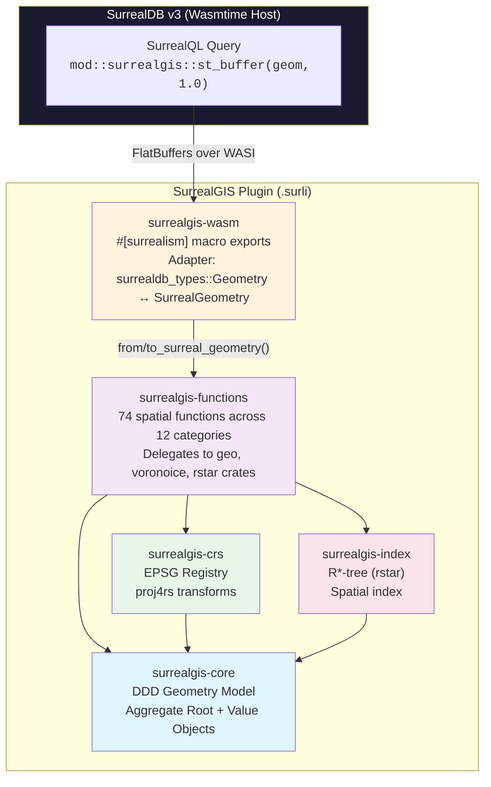
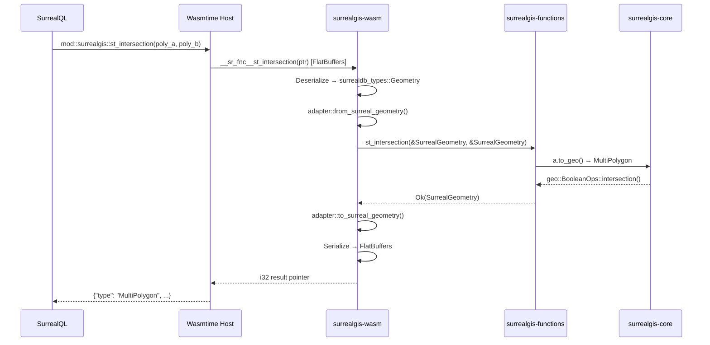
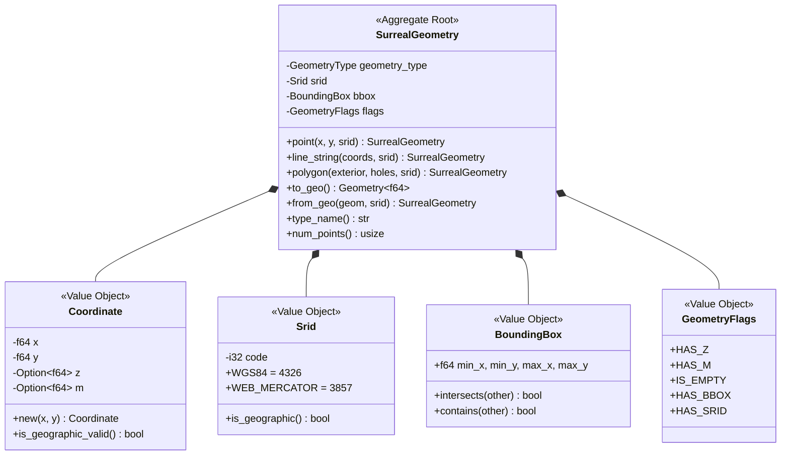
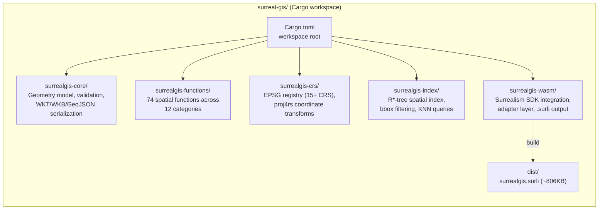

# SurrealGIS

PostGIS-equivalent geospatial extension for SurrealDB v3, built as a Surrealism WASM plugin in Rust.

SurrealDB ships with only 5 geo functions and 5 spatial operators. SurrealGIS delivers **74 spatial functions** covering constructors, accessors, predicates (DE-9IM), measurement, CRS transforms, serialization formats (WKT/WKB/GeoJSON/EWKT), affine transforms, geometry processing, boolean overlays, geometry editors, linear referencing, and spatial clustering -- a **15x improvement** over SurrealDB's built-in capabilities, packaged as a single `.surli` plugin (~806KB).

## Objective

Bring full PostGIS-class geospatial capabilities to SurrealDB without requiring external services or custom database forks. SurrealGIS runs as a sandboxed WASM plugin inside SurrealDB v3, providing:

- **Geometry construction** -- create Points, LineStrings, Polygons, and envelopes from SurrealQL
- **Spatial predicates** -- full DE-9IM relationship matrix (intersects, contains, within, touches, crosses, overlaps, covers, etc.)
- **Measurement** -- geodesic and Euclidean distance, area, length, perimeter, azimuth
- **CRS transforms** -- reproject between 15+ coordinate reference systems (WGS84, Web Mercator, UTM zones, Lambert, NAD83, etc.)
- **Format interop** -- read/write WKT, WKB, GeoJSON, EWKT
- **Spatial indexing** -- R*-tree index for efficient bbox queries and nearest-neighbor lookups
- **Affine transforms** -- translate, rotate, scale, and arbitrary affine transforms
- **Geometry processing** -- buffer, convex/concave hull, simplify, Delaunay triangulation, Voronoi diagrams
- **Boolean overlays** -- intersection, union, difference, symmetric difference
- **Geometry editors** -- reverse, snap-to-grid, collect, promote-to-multi, line merge, unary union
- **Linear referencing** -- interpolate point along line, locate point on line, extract substrings
- **Spatial clustering** -- DBSCAN, k-means++, distance-threshold clustering

## Architecture



### Data Flow



## DDD Domain Model



## Project Structure



```
surreal-gis/
├── Cargo.toml                      # Workspace root (5 crates)
├── surrealgis-core/                # Pure geometry domain model
│   └── src/
│       ├── geometry.rs             #   Aggregate Root: SurrealGeometry
│       ├── coordinate.rs           #   Value Object: Coordinate (x, y, z, m)
│       ├── srid.rs                 #   Value Object: SRID (WGS84, Web Mercator, ...)
│       ├── bbox.rs                 #   Value Object: BoundingBox
│       ├── flags.rs                #   Value Object: GeometryFlags
│       ├── validation.rs           #   Ring/polygon validation rules
│       ├── error.rs                #   Domain error types
│       ├── convert/                #   geo_types ↔ SurrealGeometry converters
│       └── serialization/          #   WKT, WKB, GeoJSON, EWKT parsers
├── surrealgis-functions/           # Spatial function implementations
│   └── src/
│       ├── constructors/           #   st_point, st_make_line, st_make_polygon, ...
│       ├── accessors/              #   st_x, st_y, st_centroid, st_boundary, ...
│       ├── relationships/          #   st_intersects, st_contains, st_relate, ...
│       ├── measurement/            #   st_distance, st_area, st_length, st_azimuth, ...
│       ├── output/                 #   st_as_text, st_as_wkb, st_as_geojson, ...
│       ├── crs/                    #   st_transform, st_set_srid
│       ├── affine/                 #   st_translate, st_rotate, st_scale, st_affine
│       ├── processing/             #   st_buffer, st_convex_hull, st_simplify, ...
│       ├── overlay/                #   st_intersection, st_union, st_difference, ...
│       ├── editors/                #   st_reverse, st_snap_to_grid, st_collect, ...
│       ├── linear_ref/             #   st_line_interpolate_point, st_line_substring, ...
│       └── clustering/             #   st_cluster_dbscan, st_cluster_kmeans, ...
├── surrealgis-crs/                 # Coordinate Reference System management
│   └── src/
│       ├── registry.rs             #   15+ EPSG definitions (4326, 3857, UTM, ...)
│       ├── projection.rs           #   proj4rs wrapper
│       └── transform.rs            #   Coordinate reprojection logic
├── surrealgis-index/               # Spatial indexing
│   └── src/
│       ├── rtree_index.rs          #   R*-tree via rstar crate
│       ├── bbox_filter.rs          #   Bounding box pre-filter
│       ├── spatial_index.rs        #   SpatialIndex trait
│       └── indexed_geometry.rs     #   Geometry → RTreeObject adapter
├── surrealgis-wasm/                # WASM plugin boundary
│   ├── Cargo.toml                  #   edition 2024, cdylib + rlib
│   ├── surrealism.toml             #   Plugin metadata (@locobuzz/surrealgis)
│   └── src/
│       ├── adapter.rs              #   surrealdb_types::Geometry ↔ SurrealGeometry
│       └── exports/                #   74 #[surrealism] annotated functions
│           ├── constructors.rs     #     5 functions
│           ├── accessors.rs        #     17 functions
│           ├── relationships.rs    #     11 functions
│           ├── measurement.rs      #     7 functions
│           ├── output.rs           #     4 functions
│           ├── crs.rs              #     2 functions
│           ├── affine.rs           #     4 functions
│           ├── processing.rs       #     7 functions
│           ├── overlay.rs          #     4 functions
│           ├── editors.rs          #     7 functions
│           ├── linear_ref.rs       #     3 functions
│           └── clustering.rs       #     3 functions
├── docker-compose.yml              # SurrealDB v3 deployment
└── dist/
    └── surrealgis.surli            # Built plugin package (~806KB)
```

## Function Reference (74 Functions)

### Constructors (5)

| Function | Signature | Description |
|---|---|---|
| `st_point` | `(float, float) -> geometry` | Create Point from x, y |
| `st_make_point` | `(float, float) -> geometry` | Alias for st_point |
| `st_make_line` | `(array<geometry>) -> geometry` | Create LineString from Points |
| `st_make_polygon` | `(geometry, array<geometry>) -> geometry` | Create Polygon from exterior ring + holes |
| `st_make_envelope` | `(float, float, float, float) -> geometry` | Create rectangle Polygon from xmin, ymin, xmax, ymax |

### Accessors (17)

| Function | Signature | Description |
|---|---|---|
| `st_x` | `(geometry) -> float` | Extract X coordinate from Point |
| `st_y` | `(geometry) -> float` | Extract Y coordinate from Point |
| `st_z` | `(geometry) -> none \| float` | Extract Z coordinate (None if 2D) |
| `st_srid` | `(geometry) -> int` | Get SRID (default: 4326) |
| `st_geometry_type` | `(geometry) -> string` | Get type name ("Point", "Polygon", ...) |
| `st_num_points` | `(geometry) -> int` | Count all coordinates |
| `st_dimension` | `(geometry) -> int` | Topological dimension (0=point, 1=line, 2=polygon) |
| `st_start_point` | `(geometry) -> geometry` | First point of LineString |
| `st_end_point` | `(geometry) -> geometry` | Last point of LineString |
| `st_is_empty` | `(geometry) -> bool` | Check if geometry has no coordinates |
| `st_is_valid` | `(geometry) -> bool` | Validate geometry structure |
| `st_is_closed` | `(geometry) -> bool` | Check if LineString first == last point |
| `st_is_ring` | `(geometry) -> bool` | Check if closed and simple |
| `st_envelope` | `(geometry) -> geometry` | Bounding box as Polygon |
| `st_centroid` | `(geometry) -> geometry` | Geometric centroid |
| `st_point_on_surface` | `(geometry) -> geometry` | Guaranteed interior point |
| `st_boundary` | `(geometry) -> geometry` | Geometry boundary |

### Spatial Relationships (11)

| Function | Signature | Description |
|---|---|---|
| `st_intersects` | `(geometry, geometry) -> bool` | Geometries share any space |
| `st_contains` | `(geometry, geometry) -> bool` | First completely contains second |
| `st_within` | `(geometry, geometry) -> bool` | First is completely within second |
| `st_touches` | `(geometry, geometry) -> bool` | Boundaries touch, interiors don't overlap |
| `st_crosses` | `(geometry, geometry) -> bool` | Geometries cross each other |
| `st_overlaps` | `(geometry, geometry) -> bool` | Partial overlap of same dimension |
| `st_disjoint` | `(geometry, geometry) -> bool` | No shared space |
| `st_equals` | `(geometry, geometry) -> bool` | Topologically equal |
| `st_covers` | `(geometry, geometry) -> bool` | No point of second is exterior to first |
| `st_covered_by` | `(geometry, geometry) -> bool` | No point of first is exterior to second |
| `st_relate` | `(geometry, geometry) -> string` | DE-9IM intersection matrix (e.g., "FF2F11212") |

### Measurement (7)

| Function | Signature | Description |
|---|---|---|
| `st_distance` | `(geometry, geometry) -> float` | Distance (geodesic for WGS84, Euclidean for projected) |
| `st_distance_sphere` | `(geometry, geometry) -> float` | Always geodesic distance (meters) |
| `st_area` | `(geometry) -> float` | Area of Polygon/MultiPolygon |
| `st_length` | `(geometry) -> float` | Length of LineString |
| `st_perimeter` | `(geometry) -> float` | Perimeter of Polygon |
| `st_azimuth` | `(geometry, geometry) -> float` | Geodesic bearing between Points (radians) |
| `st_dwithin` | `(geometry, geometry, float) -> bool` | True if distance <= threshold |

### Output (4)

| Function | Signature | Description |
|---|---|---|
| `st_as_text` | `(geometry) -> string` | Well-Known Text (WKT) |
| `st_as_wkb` | `(geometry) -> string` | Well-Known Binary (hex string) |
| `st_as_geojson` | `(geometry) -> string` | GeoJSON string |
| `st_as_ewkt` | `(geometry) -> string` | Extended WKT with SRID prefix |

### CRS Transforms (2)

| Function | Signature | Description |
|---|---|---|
| `st_transform` | `(geometry, number) -> geometry` | Reproject to target SRID |
| `st_set_srid` | `(geometry, number) -> geometry` | Change SRID metadata (no reprojection) |

### Affine Transforms (4)

| Function | Signature | Description |
|---|---|---|
| `st_translate` | `(geometry, float, float) -> geometry` | Move geometry by dx, dy |
| `st_rotate` | `(geometry, float) -> geometry` | Rotate by angle (degrees) around centroid |
| `st_scale` | `(geometry, float, float) -> geometry` | Scale by sx, sy from centroid |
| `st_affine` | `(geometry, float, float, float, float, float, float) -> geometry` | General affine transform (a, b, d, e, xoff, yoff) |

### Processing (7)

| Function | Signature | Description |
|---|---|---|
| `st_buffer` | `(geometry, float) -> geometry` | Buffer geometry by distance (Point creates circle polygon) |
| `st_convex_hull` | `(geometry) -> geometry` | Smallest convex polygon containing geometry |
| `st_concave_hull` | `(geometry, float) -> geometry` | Concave hull with concavity factor (0.0=convex, 1.0=tight) |
| `st_simplify` | `(geometry, float) -> geometry` | Simplify using Ramer-Douglas-Peucker algorithm |
| `st_simplify_preserve_topology` | `(geometry, float) -> geometry` | Simplify using Visvalingam-Whyatt (topology-safe) |
| `st_delaunay_triangles` | `(geometry) -> geometry` | Delaunay triangulation (returns GeometryCollection) |
| `st_voronoi_polygons` | `(geometry) -> geometry` | Voronoi diagram (returns GeometryCollection of polygons) |

### Overlay / Boolean Operations (4)

| Function | Signature | Description |
|---|---|---|
| `st_intersection` | `(geometry, geometry) -> geometry` | Area shared by both polygons |
| `st_union` | `(geometry, geometry) -> geometry` | Combined area of both polygons |
| `st_difference` | `(geometry, geometry) -> geometry` | Area in first polygon but not second |
| `st_sym_difference` | `(geometry, geometry) -> geometry` | Area in either polygon but not both |

### Editors (7)

| Function | Signature | Description |
|---|---|---|
| `st_reverse` | `(geometry) -> geometry` | Reverse coordinate order |
| `st_force_2d` | `(geometry) -> geometry` | Strip Z/M dimensions (PostGIS compat) |
| `st_snap_to_grid` | `(geometry, float) -> geometry` | Snap all coordinates to grid of given size |
| `st_collect` | `(array<geometry>) -> geometry` | Combine geometries into GeometryCollection |
| `st_multi` | `(geometry) -> geometry` | Promote to Multi variant (Point -> MultiPoint, etc.) |
| `st_line_merge` | `(geometry) -> geometry` | Merge connected LineStrings sharing endpoints |
| `st_unary_union` | `(geometry) -> geometry` | Union all polygons in a Multi/Collection into one |

### Linear Referencing (3)

| Function | Signature | Description |
|---|---|---|
| `st_line_interpolate_point` | `(geometry, float) -> geometry` | Point at fraction (0.0-1.0) along LineString |
| `st_line_locate_point` | `(geometry, geometry) -> float` | Fraction along LineString closest to given Point |
| `st_line_substring` | `(geometry, float, float) -> geometry` | Sub-LineString between start and end fractions |

### Clustering (3)

| Function | Signature | Description |
|---|---|---|
| `st_cluster_dbscan` | `(array<geometry>, float, int) -> geometry` | DBSCAN clustering (eps, min_points). Returns GeometryCollection of MultiPoints |
| `st_cluster_kmeans` | `(array<geometry>, int) -> geometry` | K-means++ clustering. Returns GeometryCollection of MultiPoints |
| `st_cluster_within` | `(array<geometry>, float) -> geometry` | Distance-threshold clustering. Returns GeometryCollection of MultiPoints |

## Prerequisites

- **Rust** >= 1.85 (edition 2024 support) via [rustup](https://rustup.rs/)
- **wasm32-wasip1** target for WASM compilation
- **surrealism-cli** for building `.surli` packages
- **SurrealDB v3.0.0+** for running the plugin

```bash
# Install Rust (if not already installed)
curl --proto '=https' --tlsv1.2 -sSf https://sh.rustup.rs | sh

# Add WASM target
rustup target add wasm32-wasip1

# Install Surrealism CLI
cargo install surrealism-cli

# Install SurrealDB v3
curl --proto '=https' --tlsv1.2 -sSf https://install.surrealdb.com | sh
```

## Build & Test

### Run tests

```bash
# Run all 481 tests across 5 crates
cargo test --workspace

# Lint (zero warnings policy)
cargo clippy --workspace
```

### Build the plugin

```bash
# Build .surli package (from surrealgis-wasm directory)
cd surrealgis-wasm
RUSTC=$(rustup which rustc) surrealism build -o ../dist/surrealgis.surli

# Verify the package (should list 74 functions)
surrealism info ../dist/surrealgis.surli
```

> **Note:** The explicit `RUSTC=$(rustup which rustc)` is required if Homebrew's Rust is also installed, to ensure the WASM target is available.

## Installation on SurrealDB

### Option A: Docker Compose (recommended)

```bash
# Clone and build
git clone https://github.com/nitin84india/surreal-gis.git
cd surreal-gis
cd surrealgis-wasm && RUSTC=$(rustup which rustc) surrealism build -o ../dist/surrealgis.surli && cd ..

# Start SurrealDB with plugin mounted
docker compose up -d

# Connect and load the module
curl -X POST http://localhost:8000/sql \
  -H "Accept: application/json" \
  -u "root:root" \
  -H "surreal-ns: test" -H "surreal-db: test" \
  -d 'DEFINE BUCKET surrealgis BACKEND "file:///data/plugins";
      DEFINE MODULE mod::surrealgis AS f"surrealgis:/surrealgis.surli";'
```

### Option B: Manual setup

#### Step 1: Prepare the plugin directory

```bash
mkdir -p ~/surrealgis-plugins
cp dist/surrealgis.surli ~/surrealgis-plugins/
```

#### Step 2: Start SurrealDB with experimental capabilities

Both environment variables are required -- `--allow-all` does **not** enable these:

```bash
SURREAL_CAPS_ALLOW_EXPERIMENTAL=files,surrealism \
SURREAL_BUCKET_FOLDER_ALLOWLIST="$HOME/surrealgis-plugins/" \
surreal start --user root --pass secret memory
```

#### Step 3: Load the plugin

Connect via `surreal sql`, Surrealist IDE, or any SurrealDB client:

```sql
-- Create a file bucket pointing to the plugin directory
DEFINE BUCKET surrealgis BACKEND "file:///home/user/surrealgis-plugins";

-- Register the module
DEFINE MODULE mod::surrealgis AS f"surrealgis:/surrealgis.surli";
```

### Hot-reload after rebuilding

```sql
DEFINE MODULE OVERWRITE mod::surrealgis AS f"surrealgis:/surrealgis.surli";
```

## Usage Examples

### Basic geometry operations

```sql
-- Create a point
RETURN mod::surrealgis::st_point(-74.006, 40.7128);

-- Distance between NYC and LA (geodesic, in meters)
RETURN mod::surrealgis::st_distance(
    mod::surrealgis::st_point(-74.006, 40.7128),
    mod::surrealgis::st_point(-118.2437, 34.0522)
);
-- → 3944422.23 (meters)

-- Spatial query: is a point inside an envelope?
RETURN mod::surrealgis::st_intersects(
    mod::surrealgis::st_point(0.5, 0.5),
    mod::surrealgis::st_make_envelope(0.0, 0.0, 1.0, 1.0)
);
-- → true
```

### Affine transforms

```sql
-- Move a point by (10, 20)
RETURN mod::surrealgis::st_translate(mod::surrealgis::st_point(0, 0), 10.0, 20.0);
-- → Point(10, 20)

-- Rotate a polygon 45 degrees around its centroid
RETURN mod::surrealgis::st_rotate($polygon, 45.0);

-- Scale a geometry 2x in both axes
RETURN mod::surrealgis::st_scale($line, 2.0, 2.0);
```

### Geometry processing

```sql
-- Buffer a point to create a 100m circle
RETURN mod::surrealgis::st_buffer(mod::surrealgis::st_point(0, 0), 100.0);

-- Simplify a complex line (Ramer-Douglas-Peucker)
RETURN mod::surrealgis::st_simplify($complex_line, 0.01);

-- Convex hull of scattered points
RETURN mod::surrealgis::st_convex_hull($multipoint);

-- Voronoi diagram
RETURN mod::surrealgis::st_voronoi_polygons($points_line);
```

### Boolean overlay operations

```sql
-- Intersection of two polygons
LET $a = mod::surrealgis::st_make_polygon(...);
LET $b = mod::surrealgis::st_make_polygon(...);

RETURN mod::surrealgis::st_area(mod::surrealgis::st_intersection($a, $b));
RETURN mod::surrealgis::st_union($a, $b);
RETURN mod::surrealgis::st_difference($a, $b);
RETURN mod::surrealgis::st_sym_difference($a, $b);
```

### Linear referencing

```sql
-- Point at 50% along a line
LET $road = mod::surrealgis::st_make_line([...]);
RETURN mod::surrealgis::st_line_interpolate_point($road, 0.5);

-- Where does a point project onto a line? (returns fraction 0.0-1.0)
RETURN mod::surrealgis::st_line_locate_point($road, mod::surrealgis::st_point(5, 0));

-- Extract a segment (25% to 75% of the line)
RETURN mod::surrealgis::st_line_substring($road, 0.25, 0.75);
```

### Spatial clustering

```sql
-- Cluster points using DBSCAN (eps=2.0, min_points=3)
LET $pts = [
    mod::surrealgis::st_point(0, 0), mod::surrealgis::st_point(0.5, 0.5),
    mod::surrealgis::st_point(1, 0), mod::surrealgis::st_point(10, 10),
    mod::surrealgis::st_point(10.5, 10.5), mod::surrealgis::st_point(11, 10)
];
RETURN mod::surrealgis::st_cluster_dbscan($pts, 2.0, 2);
-- → GeometryCollection with 2 MultiPoints (one per cluster)

-- K-means clustering into 3 groups
RETURN mod::surrealgis::st_cluster_kmeans($pts, 3);

-- Group all points within 5 units of each other
RETURN mod::surrealgis::st_cluster_within($pts, 5.0);
```

### Geometry editors

```sql
-- Snap coordinates to a 0.5 grid
RETURN mod::surrealgis::st_snap_to_grid(mod::surrealgis::st_point(0.3, 0.7), 0.5);
-- → Point(0.5, 0.5)

-- Collect mixed geometries into a collection
RETURN mod::surrealgis::st_collect([
    mod::surrealgis::st_point(0, 0),
    mod::surrealgis::st_make_line([...])
]);

-- Promote Point to MultiPoint
RETURN mod::surrealgis::st_multi(mod::surrealgis::st_point(1, 2));
-- → MultiPoint

-- Reverse coordinate order
RETURN mod::surrealgis::st_reverse($line);

-- Merge connected lines
RETURN mod::surrealgis::st_line_merge($multi_linestring);

-- Union all polygons in a collection
RETURN mod::surrealgis::st_unary_union($multi_polygon);
```

### Store and query spatial data

```sql
-- Store geometry on records
CREATE city SET name = "New York", location = mod::surrealgis::st_point(-74.006, 40.7128);
CREATE city SET name = "Los Angeles", location = mod::surrealgis::st_point(-118.2437, 34.0522);

-- Query with spatial functions
SELECT name, mod::surrealgis::st_as_text(location) AS wkt FROM city;

-- CRS transform
SELECT name,
    mod::surrealgis::st_transform(location, 3857) AS web_mercator
FROM city;
```

## Test Coverage

| Crate | Tests | Description |
|---|---|---|
| surrealgis-core | 109 | Value objects, validation, WKT/WKB/GeoJSON serialization, conversions |
| surrealgis-crs | 53 | EPSG registry, proj4rs transforms, roundtrip reprojections |
| surrealgis-functions | 261 | All 74 spatial functions across 12 categories |
| surrealgis-index | 53 | R*-tree queries, bulk load, KNN, within-distance, 100K scale test |
| surrealgis-wasm | 5 | Adapter roundtrip conversions (Point, LineString, Polygon, MultiPoint, Collection) |
| **Total** | **481** | |

### Tests by function category

| Category | Functions | Tests |
|---|---|---|
| Constructors | 5 | Included in functions total |
| Accessors | 17 | Included in functions total |
| Relationships | 11 | Included in functions total |
| Measurement | 7 | Included in functions total |
| Output | 4 | Included in functions total |
| CRS | 2 | Included in functions total |
| Affine Transforms | 4 | 17 |
| Processing | 7 | 40 |
| Overlay | 4 | 25 |
| Editors | 7 | 41 |
| Linear Referencing | 3 | 28 |
| Clustering | 3 | 23 |

## Key Dependencies

| Crate | Version | Purpose | WASM Safe |
|---|---|---|---|
| [geo](https://crates.io/crates/geo) | 0.32 | Spatial algorithms (Relate, Distance, ConvexHull, BooleanOps, Simplify, etc.) | Yes |
| [geo-types](https://crates.io/crates/geo-types) | 0.7 | Geometry type primitives | Yes |
| [proj4rs](https://crates.io/crates/proj4rs) | 0.1 | Pure Rust CRS transforms | Yes |
| [rstar](https://crates.io/crates/rstar) | 0.12 | R*-tree spatial index (used for DBSCAN clustering) | Yes |
| [voronoice](https://crates.io/crates/voronoice) | 0.2 | Voronoi diagram generation | Yes |
| [rand](https://crates.io/crates/rand) | 0.8 | K-means++ initialization | Yes |
| [wkt](https://crates.io/crates/wkt) | 0.11 | WKT parsing | Yes |
| [geozero](https://crates.io/crates/geozero) | 0.14 | WKB parsing, zero-copy | Yes |
| [surrealism](https://crates.io/crates/surrealism) | 0.1.9 | SurrealDB plugin macro + types | Yes |
| [surrealdb-types](https://crates.io/crates/surrealdb-types) | 3.0.0 | SurrealDB Geometry/Value types | Yes |

## Versioning

| Version | Functions | Tests | Package Size | Milestone |
|---|---|---|---|---|
| v0.1.0 | 46 | 307 | 657KB | Phase 1: Core spatial functions |
| v0.2.0 | 74 | 481 | 806KB | Phase 2: Processing & Analysis |

## License

MIT
