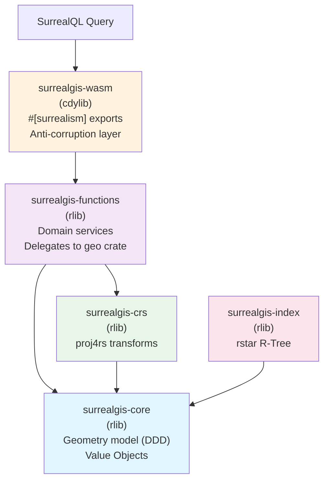
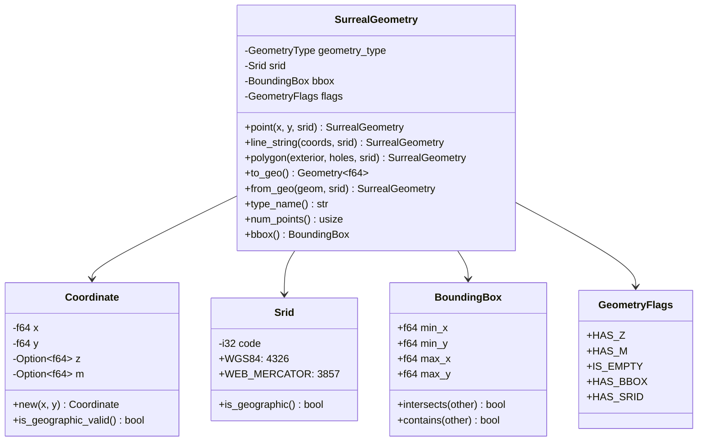
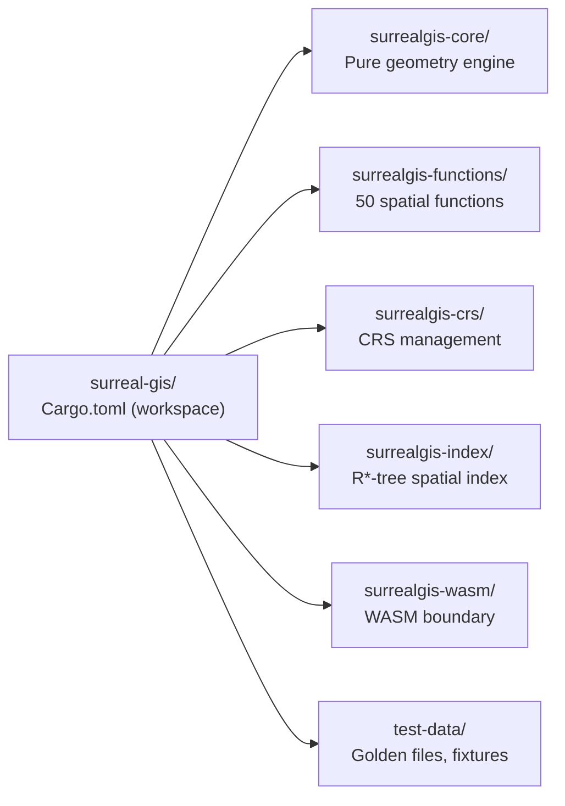

# SurrealGIS

PostGIS-equivalent geospatial extension for SurrealDB v3, built as a Surrealism WASM plugin in Rust.

SurrealDB currently has only 5 geo functions and 5 spatial operators. SurrealGIS Phase 1 delivers **~50 spatial functions** covering constructors, accessors, predicates (DE-9IM), measurement, CRS transforms, and serialization formats (WKT/WKB/GeoJSON) -- a **10x improvement** over SurrealDB's built-in capabilities.

## Architecture



## DDD Design



## Workspace Structure



## Function Inventory (50 Functions)

| # | Function | Category | Description |
|---|---|---|---|
| 1 | `st_point` | Constructor | Create Point from x, y |
| 2 | `st_make_point` | Constructor | Alias for st_point |
| 3 | `st_make_line` | Constructor | Create LineString from points |
| 4 | `st_make_polygon` | Constructor | Create Polygon from rings |
| 5 | `st_make_envelope` | Constructor | Create rectangle Polygon |
| 6 | `st_x` | Accessor | Extract X coordinate |
| 7 | `st_y` | Accessor | Extract Y coordinate |
| 8 | `st_z` | Accessor | Extract Z coordinate |
| 9 | `st_srid` | Accessor | Get SRID |
| 10 | `st_geometry_type` | Accessor | Get type name |
| 11 | `st_num_points` | Accessor | Count points |
| 12 | `st_envelope` | Accessor | Bounding box as Polygon |
| 13 | `st_centroid` | Accessor | Geometric centroid |
| 14 | `st_is_empty` | Predicate | Check if empty |
| 15 | `st_is_valid` | Predicate | Validate geometry |
| 16 | `st_dimension` | Accessor | Topological dimension |
| 17 | `st_start_point` | Accessor | First point of LineString |
| 18 | `st_end_point` | Accessor | Last point of LineString |
| 19 | `st_is_closed` | Predicate | Check if ring is closed |
| 20 | `st_is_ring` | Predicate | Check if closed and simple |
| 21 | `st_point_on_surface` | Accessor | Interior point |
| 22 | `st_boundary` | Accessor | Geometry boundary |
| 23 | `st_intersects` | Relationship | Spatial intersection |
| 24 | `st_contains` | Relationship | Contains check |
| 25 | `st_within` | Relationship | Within check |
| 26 | `st_touches` | Relationship | Touches boundary |
| 27 | `st_crosses` | Relationship | Crosses check |
| 28 | `st_overlaps` | Relationship | Overlaps check |
| 29 | `st_disjoint` | Relationship | Disjoint check |
| 30 | `st_equals` | Relationship | Topological equality |
| 31 | `st_covers` | Relationship | Covers check |
| 32 | `st_covered_by` | Relationship | Covered by check |
| 33 | `st_relate` | Relationship | DE-9IM matrix |
| 34 | `st_distance` | Measurement | Distance (auto geodesic/euclidean) |
| 35 | `st_area` | Measurement | Area computation |
| 36 | `st_length` | Measurement | Length of LineString |
| 37 | `st_perimeter` | Measurement | Perimeter of Polygon |
| 38 | `st_azimuth` | Measurement | Bearing between points |
| 39 | `st_distance_sphere` | Measurement | Always geodesic distance |
| 40 | `st_dwithin` | Measurement | Distance threshold check |
| 41 | `st_as_text` | Output | To WKT |
| 42 | `st_as_wkb` | Output | To WKB hex |
| 43 | `st_as_geojson` | Output | To GeoJSON |
| 44 | `st_as_ewkt` | Output | To Extended WKT |
| 45 | `st_geom_from_text` | Input | Parse WKT |
| 46 | `st_geom_from_wkb` | Input | Parse WKB |
| 47 | `st_geom_from_geojson` | Input | Parse GeoJSON |
| 48 | `st_geom_from_ewkt` | Input | Parse EWKT |
| 49 | `st_transform` | CRS | Coordinate reprojection |
| 50 | `st_set_srid` | CRS | Change SRID metadata |

## Build

### Prerequisites

```bash
rustup target add wasm32-unknown-unknown
cargo install surrealism-cli  # When available
```

### Native build & test

```bash
cargo test --workspace          # Run all 400 tests
cargo clippy --workspace        # Lint checks
```

### WASM build

```bash
# With rustup-managed Rust (required for WASM target):
RUSTC=$(rustup which rustc) cargo build -p surrealgis-wasm --target wasm32-unknown-unknown --release
```

Binary output: `target/wasm32-unknown-unknown/release/surrealgis_wasm.wasm` (~977KB)

### Docker (SurrealDB integration)

```bash
docker compose up -d
```

## Test Coverage

| Crate | Tests | Description |
|---|---|---|
| surrealgis-core | 109 | Value objects, conversions, serialization |
| surrealgis-crs | 53 | EPSG registry, proj4rs transforms |
| surrealgis-functions | 87 | All 50 spatial functions |
| surrealgis-index | 53 | R*-tree queries, bulk load |
| surrealgis-wasm | 96 | JSON adapter, all exports |
| **Total** | **398** | |

## Key Dependencies

| Crate | Purpose | WASM Safe |
|---|---|---|
| geo 0.29 | Algorithms: Relate, Distance, Area, Centroid | Yes |
| geo-types 0.7 | Geometry types | Yes |
| proj4rs 0.1 | Pure Rust CRS transforms | Yes |
| rstar 0.12 | R*-tree spatial index | Yes |
| wkt 0.11 | WKT parsing | Yes |
| geozero 0.14 | WKB parsing, zero-copy | Yes |

## License

MIT
